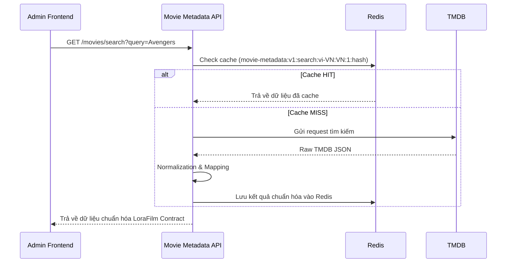
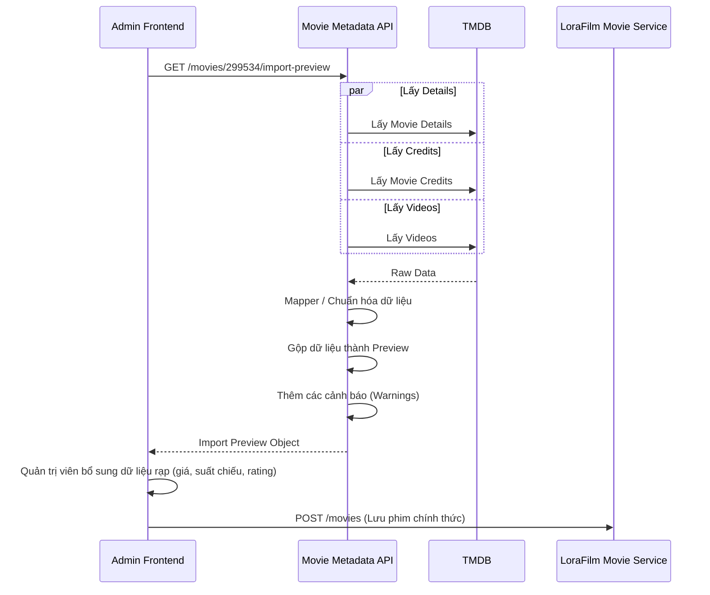

# Kiến trúc LoraFilm Movie Metadata API

Tài liệu này mô tả chi tiết về mặt kiến trúc phần mềm, luồng xử lý và cách ứng dụng này tương tác với thế giới bên ngoài.

## Mục tiêu kiến trúc
1. **Phân tách trách nhiệm (Separation of Concerns)**: API chỉ dùng để tra cứu metadata, không chịu trách nhiệm lưu trữ phim, tạo suất chiếu hay bán vé. Đó là nhiệm vụ của `LoraFilm Movie Service`.
2. **Khả năng mở rộng nhà cung cấp**: Hệ thống cung cấp `MovieMetadataProvider` interface để tương lai có thể đổi từ TMDB sang IMDB hoặc một dịch vụ khác mà không ảnh hưởng tới API contract nội bộ.
3. **Hiệu suất & Ổn định**: Hệ thống sử dụng Redis Cache để giảm thiểu lời gọi tới API bên thứ 3 (TMDB), đồng thời có fallback xuống Memory Cache nếu Redis gặp sự cố.

## Sơ đồ luồng tìm kiếm phim (Search Flow)

## Sơ đồ luồng lấy Import Preview
Đóng vai trò quan trọng trong việc hiển thị một màn hình duy nhất cho quản trị viên trước khi đưa phim vào hệ thống.

## Giải thích thêm về giới hạn
Dịch vụ này KHÔNG trực tiếp tạo dữ liệu (persist) vào `LoraFilm Movie Service` DB. Dữ liệu được trả về Frontend, Frontend hiển thị lên form và yêu cầu Admin hoàn tất các thông tin đặc thù của rạp chiếu phim (Ticket Price, LoraFilm Internal ID, Showtime, Age Rating) rồi mới gọi lên `Movie Service` để lưu trữ chính thức.
